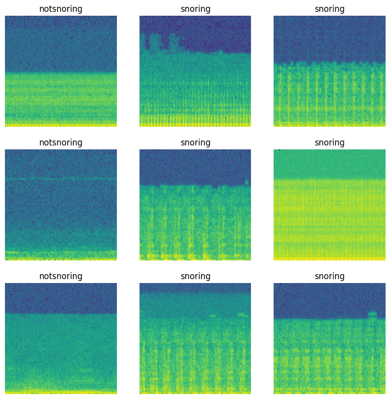

# Detector de ronco com aprendizado profundo 




> Este projeto contém um modelo de deep learning baseado em um [tutorial do TensorFlow](https://www.tensorflow.org/tutorials/audio/simple_audio?hl=pt-br) para identificar sons de ronco (snoring) e não ronco (not snoring). Desenvolvido como parte de um projeto de pesquisa na PUCRS, ele visa auxiliar na análise de distúrbios do sono.

### Tecnlogias


### Processo de desenvolvimeno utilizando Crisp-DM

O projeto ainda está em desenvolvimento e as próximas atualizações serão voltadas para as seguintes tarefas:

- [x] Business Understanding
- [] Data Understanding
- [] Data Preparation
- [] Data Understanding (Again)
- [] Modeling
- [] Evaluation
- [] Deployment
- [] Conclusion


## 🚀 Instalando snoring

Para instalar o snoring, siga estas etapas:

### 💻 Pré-requisitos

Antes de começar, verifique se você atendeu aos seguintes requisitos:

- Você leu [Tensorflow: Reconhecimento de áudio simples](https://www.tensorflow.org/tutorials/audio/simple_audio?hl=pt-br).
- Instalou o Visual Studio Code com a extensão do Jupyter.
- Instalou o Python 3.12.6 na sua máquina.

### 🪟 Instalação no Windows:

1. Clone o repositório:
    ```bash
    git clone https://github.com/FlorensaDimer/snoring.git
    cd snoring
    ```
2. Crie e ative o ambiente virtual (.venv):
    ```bash
    python -m venv .venv
    .venv\Scripts\activate
    ```
3. Instale as dependências:
    ```bash
    pip install -r requirements.txt
    ```
3. Abra o projeto no Visual Studio Code:
    - Na pasta do repositório, abra o VS Code:
    ```bash
    code .
    ```
    - Selecione o kernel do Jupyter usando a ```.venv``` que você criou.
5. Execute o notebook:
    - Abra o notebook desejado e selecione a ```.venv``` como o ambiente Python.


## 🤝 Colaboradores

A seguintes pessoas que contribuíram para este projeto:

<table>
  <tr>
    <td align="center">
      <a href="https://github.com/FlorensaDimer" title="Florensa Dimer">
        <br>
        <sub>
          <b>Florensa Dimer</b>
        </sub>
      </a>
    </td>
  </tr>
</table>

## 📝 Licença

Esse projeto está sob licença. Veja o arquivo [LICENÇA](LICENSE) para mais detalhes.
